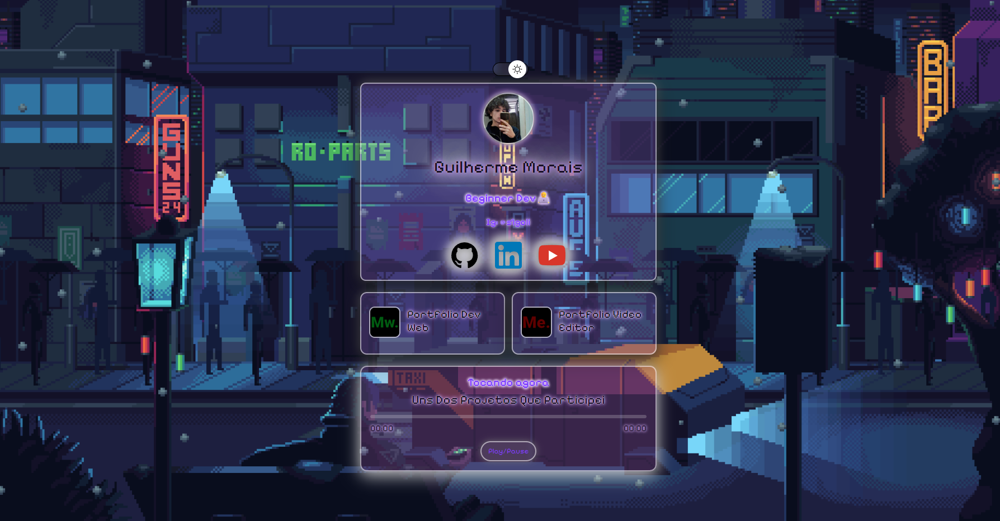
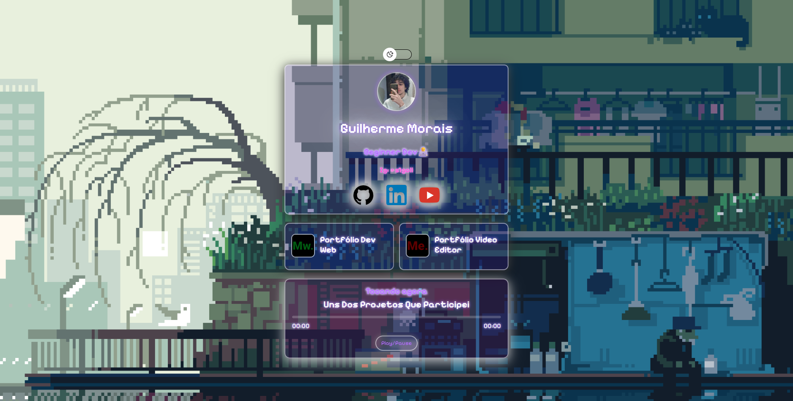

# Portfólio pessoal / Hub de links

Site pessoal com estética pixel art, glassmorphism e brilho neon. A página inicial funciona como meu hub principal, reunindo redes sociais, portfólios e projetos.

## Recursos

- Fundos animados em pixel art
- Alternância entre tema claro e escuro
- Interface com glassmorphism
- Layout responsivo
- Acesso rápido às minhas redes sociais
- Tocador de música
- Portfólio de desenvolvimento web
- Portfólio de edição de vídeo
- Estrutura modular para adicionar novos projetos

## Como adicionar projetos

Os projetos ficam diretamente no HTML para facilitar a edição manual:

- Desenvolvimento web: edite os cards em `dev/index.html`
- Edição de vídeo: edite o destaque e os cards em `video/index.html`

Em cada card você pode alterar título, descrição, imagem, texto alternativo, link e texto do botão. Para vídeos, coloque o endereço do YouTube, Vimeo, Drive ou arquivo publicado no `href` do botão "Assistir vídeo".

## Tecnologias

- HTML5
- CSS3
- JavaScript

## Prévia

### Tema escuro

### Tema claro

## Contato

- GitHub
- LinkedIn
- YouTube
