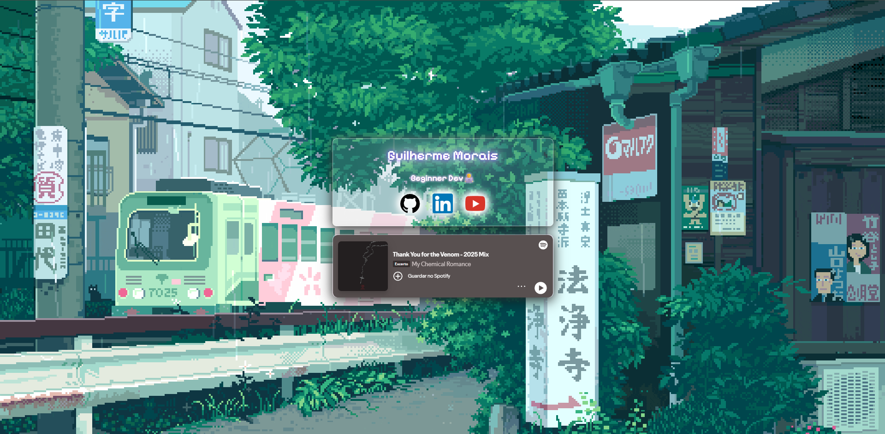

# 🌐 Meu Primeiro Portfólio

Este é o meu primeiro site desenvolvido com HTML e CSS.

## 🚀 Acesse o Site

🔗
https://guimoraiss.github.io/moraizz/

## 📌 Sobre

O projeto foi criado para apresentar um pouco sobre mim, minhas redes sociais e meus interesses de forma simples e visual.

## 🚀 Tecnologias Utilizadas

- HTML
- CSS

## 🎨 Características

- Layout centralizado
- Efeito Glassmorphism
- Fundo animado em pixel art
- Links para redes sociais
- Player de música integrado

## 📷 Preview

## 🔗 Redes Sociais

- GitHub
- LinkedIn
- YouTube

## 📚 Objetivo

Este projeto foi desenvolvido com o objetivo de praticar conceitos básicos de desenvolvimento web e servir como meu primeiro portfólio online.

## 👨‍💻 Autor

**Guilherme Morais**

Beginner Developer 🚀